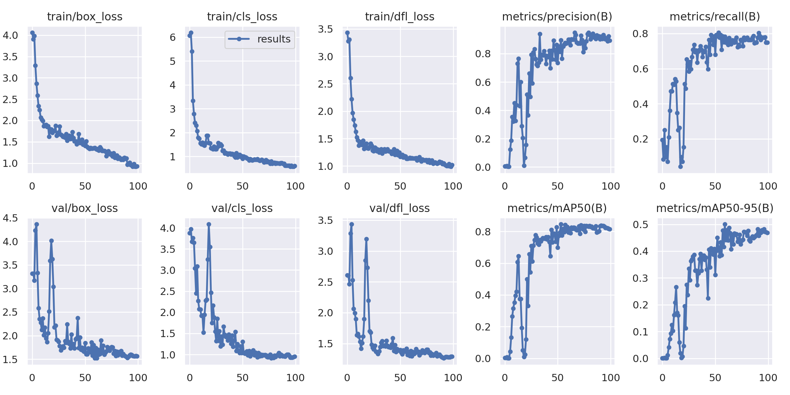

# Toro-BitsxlaMarato-2023

This repository contains our group's solution to the challenge *Les línies de la vida* proposed by *l'Institut de Recerca de l'Hospital de la Santa Creu i Sant Pau*. 

The structure of the project is as follows:
  * Backend: implemented in Python, it uses conventional vision techniques, provided mainly by openCV, to extract the data present in the graphics of the images. Despite that, the usage of AI in order to perform the same task has been implemented and is ready to be integrated. In order to process the information, the team has developed some algorithms, although the use of classification and regression neural networks would be advised to identify new data paterns.
  * Frontend: developed in React, it aims to provide an easy to use and aesthetic interface that seamlessly integrates all the backend functionalities. 

## AI

### Vision models:

YOLO-V8 Network was tested to detect contractions using a very reduced dataset. Despite that, it managed to obtain relatively good results with an inference mean time of 18ms using a T4 GPU. This model, due to the lack of time, is not yet available on the app.

Here are some of the results obtained by the model after training:

### Feedforward networks

The team considers that once the data is obtained from the images, it should be processed using feedforward networks able to identify dependencies and relationships between the variables in order to make. Two different types of networks should be implemented:
 * Regression networks
 * Classification networks

It should be noted that the use of sequence models, such as RNN, LSTM or Transformers could also be an option.

## Backend algorithms

Two main algorithms (cardiac frequency and contractions) have been implemented to automatically retrieve the data from the images minimizing the information loss. Two images displaying their behaviour are available:

As seen in the photo shown above, the algorithm first determines the mean of the FCFb (*Freqüència cardíaca fetal*) and, then, using quantiles and the standard deviation, accelerations, decelerations and variability are calculated.

As seen in the photo shown above, the algorithm first determines the mean and, then calculates the amount of contractions that have occured.

## What's next

 * Implementing more visual models (CNN and vision transformers) to determine the viability of retrieving data and processing it using these architectures.
 * Implementing feedforward networks to process the information once its obtained.
 * Improve the frontend.

 